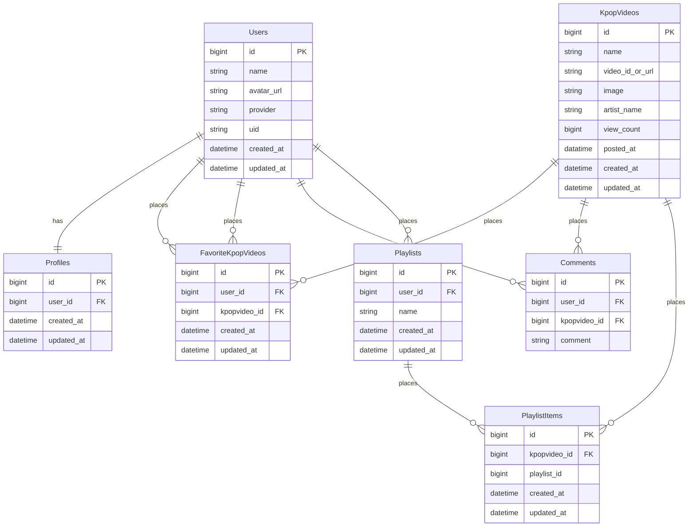

```mermaid
erDiagram

Users ||--|| Profiles : has
Users ||--o{ FavoriteKpopVideos : places
Users ||--o{ FavoriteKpopVideos : places
KpopVideos ||--o{ FavoriteKpopVideos : places
Users ||--o{ Comments : places
KpopVideos ||--o{ Comments : places
Users ||--o{ Playlists : places
KpopVideos ||--o{ PlaylistItems : places
Playlists ||--o{ PlaylistItems : places


Users {
 bigint id PK
 string name
 string avatar_url
 string provider
 string uid
 datetime created_at
 datetime updated_at
}

Profiles {
 bigint id PK
 bigint user_id FK
 datetime created_at
 datetime updated_at
}

KpopVideos {
 bigint id PK
 string name
 string video_id_or_url
 string image
 string artist_name
 bigint view_count
 datatime posted_at
 datetime created_at
 datetime updated_at
}

Comments {
 bigint id PK
 bigint user_id FK
 bigint kpopvideo_id FK
 string comment
}

FavoriteKpopVideos {
 bigint id PK
 bigint user_id FK
 bigint kpopvideo_id FK
 datetime created_at
 datetime updated_at
}

Playlists {
 bigint id PK
 bigint user_id FK
 string name
 datetime created_at
 datetime updated_at
}

PlaylistItems {
 bigint id PK
 bigint kpopvideo_id FK
 bigint playlist_id
 datetime created_at
 datetime updated_at
}
```