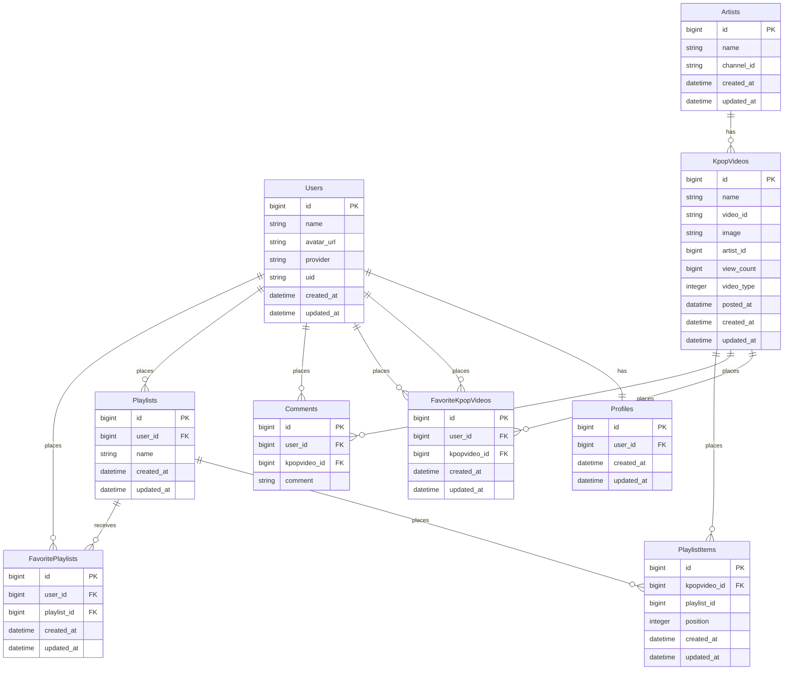

## README記載中

## ER図



## サービス概要
Youtubeの膨大な動画の中から、K-POP動画のみを提供するサービスです。動画に対してお気に入りやプレイリストを作成することができ、また、他ファンのプレイリストを探索することで、色々な楽曲に出会うことができます。動画モード（YoutubeAPI）に対して、音楽モード（Spotify）も実装予定。
YoutubeAPIを使用して、本番運用前に必要な動画情報を全て保存しておき、運用中は定期的（数時間毎）に動画を取得して保存する。（レートミット考慮）

## 実装予定
### ■ MVP リリース
- ユーザー登録機能
  - Googleログイン（NextAuth.js）
- プロフィール機能
- K-POP動画
  - 動画一覧表示
  - 動画詳細表示
  - 動画検索機能
  - フィルタリング機能（アーティスト名等）
  - KPOPの動画はYoutubeAPIを使用して、取得、DBに保存（動画情報）
  - 表示する際は、埋め込み表示
- お気に入り機能
- プレイリスト機能
- プレイリストに対してお気に入りができる機能
- Youtube APIを使用した動画取得（管理者画面）
  - 指定アーティストの全動画一括取得機能
  - 定期的な新規動画取得機能（数時間ごと）
  - 特定動画の個別取得機能（エラー復旧用）
- レコメンド機能（色々な形で、動画をおすすめする）
- ランキング機能
  - お気に入り数に基づく動画ランキング機能
  - お気に入り数に基づくプレイリストランキング機能

### ■ 本リリース
- RSpec
- カスタムフィルタリング
続く


This is a [Next.js](https://nextjs.org/) project bootstrapped with [`create-next-app`](https://github.com/vercel/next.js/tree/canary/packages/create-next-app).

## Getting Started

First, run the development server:

```bash
npm run dev
# or
yarn dev
# or
pnpm dev
# or
bun dev
```

Open [http://localhost:3000](http://localhost:3000) with your browser to see the result.

You can start editing the page by modifying `app/page.tsx`. The page auto-updates as you edit the file.

This project uses [`next/font`](https://nextjs.org/docs/basic-features/font-optimization) to automatically optimize and load Inter, a custom Google Font.

## Learn More

To learn more about Next.js, take a look at the following resources:

- [Next.js Documentation](https://nextjs.org/docs) - learn about Next.js features and API.
- [Learn Next.js](https://nextjs.org/learn) - an interactive Next.js tutorial.

You can check out [the Next.js GitHub repository](https://github.com/vercel/next.js/) - your feedback and contributions are welcome!

## Deploy on Vercel

The easiest way to deploy your Next.js app is to use the [Vercel Platform](https://vercel.com/new?utm_medium=default-template&filter=next.js&utm_source=create-next-app&utm_campaign=create-next-app-readme) from the creators of Next.js.

Check out our [Next.js deployment documentation](https://nextjs.org/docs/deployment) for more details.
